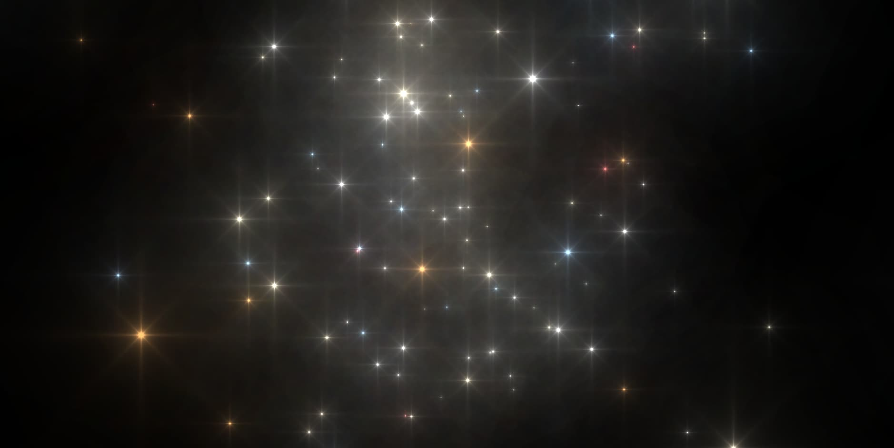

<div>

# Magic Particles 3D

### *Stars dancing in the void*


<br>

A three-dimensional particle system where 150 eight-pointed stars follow harmonic trajectories through infinite space. Each star emits its own light with a carefully calibrated color palette, creating a visual experience that feels alive.

</div>

---

## Table of Contents

- [Overview](#overview)
- [Features](#features)
- [Technologies](#technologies)
- [Quick Start](#quick-start)
- [Controls](#controls)
- [Architecture](#architecture)
- [Customization](#customization)
- [Performance](#performance)
- [License](#license)

---

## Overview

Magic Particles 3D is a visual exploration of harmonic motion applied to particle systems. The project was born from a simple question: *What happens when stars obey the laws of music?*

Each particle is an eight-pointed star — horizontal, vertical, and diagonal — generated through mathematical calculations in the fragment shader. No external textures, no predefined models. Everything is generated in real-time using only the GPU.

The result is a star field that breathes, that pulses, that moves with an organicity unexpected for something generated entirely by code.

---

## Features

| Aspect | Detail |
|:-------|:-------|
| **Dimensionality** | Full 3D system with perspective and depth |
| **Rendering** | Custom GLSL shader running on the GPU |
| **Stars** | 8 branches per star: 4 main + 4 diagonal |
| **Colors** | 5 tones with calibrated percentage distribution |
| **Movement** | Sinusoidal harmonic trajectories per axis |
| **Effects** | Soft glow, temporal flickering, additive blending |
| **Interaction** | Full navigation: rotation, panning, zoom |
| **Performance** | Optimized for 60fps on integrated hardware |

### Color Palette

The color distribution is not random. Each percentage was chosen to create a visual balance that feels natural:

```
Pure white        ████████████████████░░░░░░░░░░░░░░░░░░░░  45%
Warm white        ██████████░░░░░░░░░░░░░░░░░░░░░░░░░░░░░░  25%
Soft blue         ██████░░░░░░░░░░░░░░░░░░░░░░░░░░░░░░░░░░  15%
Warm orange       ████░░░░░░░░░░░░░░░░░░░░░░░░░░░░░░░░░░░░  10%
Faint red         ██░░░░░░░░░░░░░░░░░░░░░░░░░░░░░░░░░░░░░░   5%
```

---

## Technologies

| Technology | Usage | Why |
|:-----------|:------|:----|
| **Three.js 0.160** | 3D rendering engine | The most mature library for WebGL in JavaScript |
| **GLSL** | Vertex and fragment shaders | Allows running complex calculations directly on the GPU |
| **OrbitControls** | Camera navigation | Intuitive interaction with no extra code |
| **ES Modules** | Module system | Native browser imports, no bundler needed |

No build dependencies. No bundler. No transpilation. The code runs exactly as the browser reads it.

---

## Quick Start

### Requirements

- A modern web browser
- A local server (due to ES Modules restrictions)

### Installation

```bash
git clone https://github.com/your-user/magic-particles-3d.git
cd magic-particles-3d
```

### Running

Any of these options work:

```bash
# Python (installed by default on most systems)
python -m http.server 8000

# Node.js
npx serve

# PHP
php -S localhost:8000
```

Then open `http://localhost:8000` in your browser.

> **Note:** Opening `index.html` directly as a file (`file://`) is not recommended, as ES Modules require an HTTP server to function correctly.

---

## Controls

| Action | Input |
|:-------|:------|
| Rotate the scene | Left click + drag |
| Pan the camera | Right click + drag |
| Zoom in / out | Mouse wheel |
| Reset view | Reload the page |

---

## Architecture

### Render Flow

```
┌─────────────────────────────────────────────────────────┐
│                     Each frame                          │
├─────────────────────────────────────────────────────────┤
│                                                         │
│   1. Update time (uTime)                                │
│              ↓                                          │
│   2. Vertex Shader: calculate 3D position               │
│      └─ Apply sinusoidal harmonic movement              │
│              ↓                                          │
│   3. Rasterize points as quads                          │
│              ↓                                          │
│   4. Fragment Shader: draw 8-pointed star               │
│      ├─ Calculate distance to center                    │
│      ├─ Calculate distances to each branch              │
│      ├─ Combine intensities                             │
│      ├─ Select color based on distribution              │
│      └─ Apply glow and alpha                            │
│              ↓                                          │
│   5. Additive blending on framebuffer                   │
│              ↓                                          │
│   6. Display on screen                                  │
│                                                         │
└─────────────────────────────────────────────────────────┘
```

### Code Structure

```
magic-particles-3d/
├── index.html        →  Entry point, loads modules
├── script.js         →  Scene, cameras, shaders, animation
├── style.css         →  CSS reset, full-screen canvas
└── README.md         →  This file
```

The project is intentionally minimalist. A single JavaScript file contains all the logic, including the GLSL shaders as template literals. This decision facilitates experimentation: one file to edit, one place to look for everything.

---

## Customization

### Particle Count

```javascript
const NB_PARTICLES = 150;  // Increase or decrease as needed
```

> More particles mean more GPU load. On integrated hardware, it is recommended to stay below 200.

### Movement Speed

The three axes are controlled independently in the vertex shader:

```glsl
pos.y += sin(uTime * 0.5 + position.x * 0.1) * 1.0;  // Vertical
pos.x += cos(uTime * 0.3 + position.y * 0.1) * 0.8;  // Horizontal
pos.z += sin(uTime * 0.2 + position.z * 0.1) * 0.9;  // Depth
//         ↑          ↑                   ↑
//      Speed    Frequency         Amplitude
```

### Colors

The palette is defined in the fragment shader. Each `rand` range controls the probability of appearance:

```glsl
if (rand < 0.45)      baseColor = vec3(1.0, 1.0, 1.0);   // White
else if (rand < 0.70) baseColor = vec3(1.0, 0.96, 0.84); // Warm
else if (rand < 0.85) baseColor = vec3(0.66, 0.84, 1.0); // Blue
else if (rand < 0.95) baseColor = vec3(1.0, 0.71, 0.42); // Orange
else                  baseColor = vec3(1.0, 0.48, 0.48); // Red
```

### Star Size

```javascript
sizes[i] = Math.random() * 40 + 20;  // Range: 20px to 60px
```

### Glow Intensity

The halo effect is controlled by the divisor in the fragment shader:

```glsl
float starIntensity = 1.0 / (dist * 200.0 + 0.02);
//                                     ↑
//                    Higher value = smaller glow
//                    Lower value = larger glow
```

---

## Performance

The project is optimized to maintain 60fps on most hardware:

| Factor | Optimization |
|:-------|:-------------|
| **GPU-bound** | All heavy calculations run in the shader, not on CPU |
| **No textures** | No asset loading or texture sampling |
| **No complex geometry** | Only Points with shaders, no triangulated meshes |
| **Additive blending** | Less overhead than traditional alpha blending |
| **No deep copy** | Only the `uTime` uniform is updated each frame |

### Reference Benchmarks

| Hardware | Estimated FPS |
|:---------|:--------------|
| Dedicated GPU (GTX 1060 or higher) | Constant 60 fps |
| Integrated GPU (Intel UHD 620) | 55-60 fps |
| MacBook Air (M1) | Constant 60 fps |
| Modern mobile (2022+) | 45-60 fps |

---

## Technical Decisions

**Why Points instead of instanced meshes?**

Stars are essentially quads that always face the camera. Points are the most efficient abstraction for this use case: a single draw call, a single geometry buffer, and the size is controlled directly in the vertex shader.

**Why not use a post-processor for the glow?**

The glow is achieved mathematically in the fragment shader using an inverse attenuation function. This avoids an additional render pass and keeps the pipeline simple.

**Why ES Modules without a bundler?**

To eliminate friction. No `npm install`, no webpack configuration, no build step. The code is modified and reloaded. This is ideal for experimentation and learning.

---

## License

This project is distributed under the MIT License. See the [LICENSE](LICENSE) file for details.

```
MIT License - 2026
```

---

<div align="center">

*Built with Three.js and curiosity*
</br>
Made with ❤️ by <a href="https://sebas-dev.vercel.app/" target="_blank" rel="noopener noreferrer">Sebastián V.</a>

</div>
